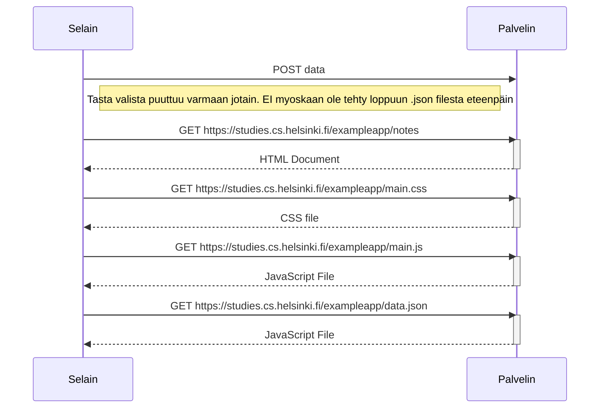

```mermaid
sequenceDiagram
    participant Selain
    participant Palvelin
    Selain->>Palvelin: POST data
    Note right of Selain: Tasta valista puuttuu varmaan jotain. EI myoskaan ole tehty loppuun .json filesta eteenpäin 
    Selain->>Palvelin: GET https://studies.cs.helsinki.fi/exampleapp/notes
    activate Palvelin
    Palvelin-->>Selain: HTML Document
    deactivate Palvelin
    Selain->>Palvelin: GET https://studies.cs.helsinki.fi/exampleapp/main.css
    activate Palvelin
    Palvelin-->>Selain: CSS file
    deactivate Palvelin
    Selain->>Palvelin: GET https://studies.cs.helsinki.fi/exampleapp/main.js
    activate Palvelin
    Palvelin-->>Selain: JavaScript File
    deactivate Palvelin
    Selain->>Palvelin: GET https://studies.cs.helsinki.fi/exampleapp/data.json
    activate Palvelin
    Palvelin-->>Selain: JavaScript File
    deactivate Palvelin
```
