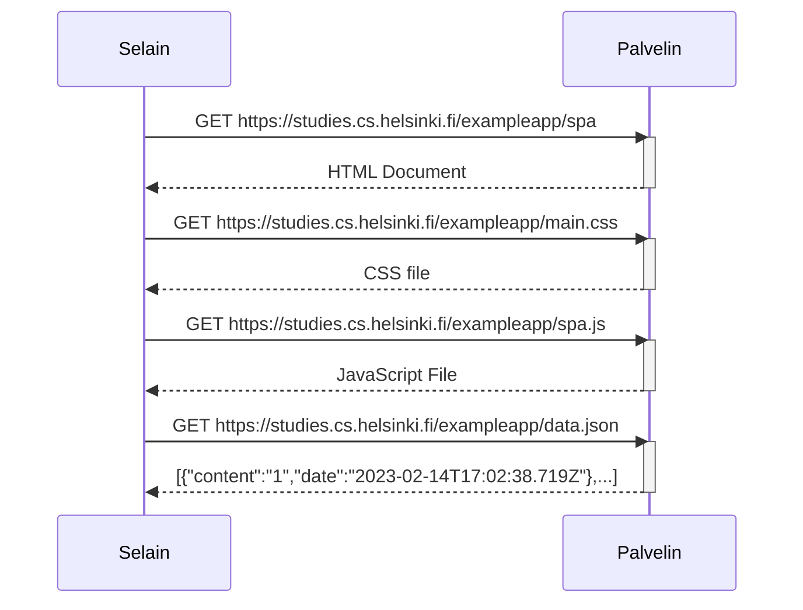

```mermaid
sequenceDiagram
    participant Selain
    participant Palvelin
    Selain->>Palvelin: GET https://studies.cs.helsinki.fi/exampleapp/spa
    activate Palvelin
    Palvelin-->>Selain: HTML Document
    deactivate Palvelin
    Selain->>Palvelin: GET https://studies.cs.helsinki.fi/exampleapp/main.css
    activate Palvelin
    Palvelin-->>Selain: CSS file
    deactivate Palvelin
    Selain->>Palvelin: GET https://studies.cs.helsinki.fi/exampleapp/spa.js
    activate Palvelin
    Palvelin-->>Selain: JavaScript File
    deactivate Palvelin
    Selain->>Palvelin: GET https://studies.cs.helsinki.fi/exampleapp/data.json
    activate Palvelin
    Palvelin-->>Selain: [{"content":"1","date":"2023-02-14T17:02:38.719Z"},...]
    deactivate Palvelin
```
